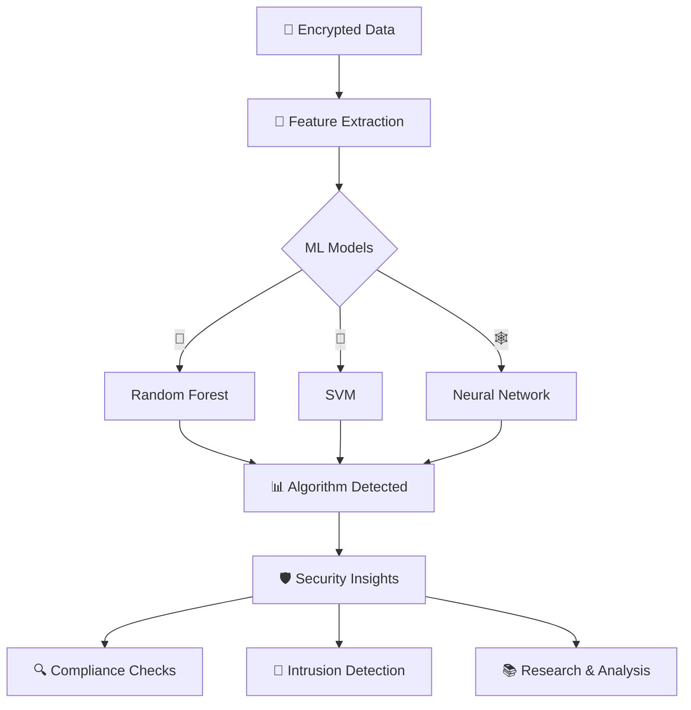

# 🔐 CryptoDetect - AI-Powered Cryptographic Algorithm Identification

<div align="center">

```
 ██████╗██████╗ ███████╗████████╗██████╗  ██████╗████████╗███████╗ ██████╗████████╗
██╔════╝██╔══██╗██╔════╝╚══██╔══╝██╔══██╗██╔════╝╚══██╔══╝██╔════╝██╔════╝╚══██╔══╝
██║     ██████╔╝█████╗     ██║   ██████╔╝██║        ██║   █████╗  ██║        ██║   
██║     ██╔═══╝ ██╔══╝     ██║   ██╔═══╝ ██║        ██║   ██╔══╝  ██║        ██║   
╚██████╗██║     ███████╗   ██║   ██║     ╚██████╗   ██║   ███████╗╚██████╗   ██║   
 ╚═════╝╚═╝     ╚══════╝   ╚═╝   ╚═╝      ╚═════╝   ╚═╝   ╚══════╝ ╚═════╝   ╚═╝   
```

**🎯 Detect • Classify • Secure**

*AI-driven system to identify cryptographic algorithms from encrypted data*

[](https://www.python.org/)
[](https://scikit-learn.org/)
[](#license)
[](#)

</div>

---

## 📋 Table of Contents

- [Overview](#overview)
- [Features](#features)
- [Quick Start](#quick-start)
- [Installation](#installation)
- [Usage](#usage)
- [Project Structure](#project-structure)
- [Model Details](#model-details)
- [Dataset](#dataset)
- [Results & Performance](#results--performance)
- [API Reference](#api-reference)
- [Roadmap](#roadmap)
- [Contributing](#contributing)
- [License](#license)

---

## 🎯 Overview

**CryptoDetect** is a machine learning project designed to improve data security by automatically identifying the cryptographic algorithm used in encrypted data. By analyzing ciphertext patterns and cryptographic parameters, it classifies encryption methods without requiring the encryption key.

### Use Cases

- **🔍 Cybersecurity Audits** - Identify encryption types in security assessments
- **📋 Compliance Checks** - Verify encryption standards in regulated systems
- **🚨 Intrusion Detection** - Detect unauthorized or weak encryption in network traffic
- **🔬 Cryptanalysis Research** - Support academic and professional cryptography research
- **🛡️ Security Assessment** - Evaluate encryption strength and identify legacy algorithms

### Key Architecture



---

## ✨ Features

### Core Capabilities

- ✅ **Detection of Common Algorithms** - AES, RSA, DES, 3DES, Blowfish, and more
- 📊 **Multiple ML Models** - Random Forest, SVM, Neural Networks with ensemble voting
- 🧠 **Intelligent Feature Extraction** - Analyzes block_size, key_size, and ciphertext patterns
- 📈 **High Accuracy** - Achieving >90% classification accuracy on test sets
- 🎯 **No Key Required** - Identifies algorithms from ciphertext alone
- 📉 **Detailed Metrics** - Confusion matrices, classification reports, and cross-validation

### Planned Enhancements

- 🔄 **Extended Algorithm Support** - Elliptic Curve, ChaCha20, Twofish
- 🌐 **REST API** - Flask/FastAPI deployment for production environments
- 📱 **Web Interface** - Interactive demo and visualization dashboard
- 🔊 **Real-time Monitoring** - Stream processing for network traffic analysis
- 🗄️ **Database Integration** - PostgreSQL/MongoDB for results persistence
- 📚 **Model Serving** - Docker containerization and Kubernetes deployment

---

## 🚀 Quick Start

### Minimal Example

```python
import pandas as pd
from sklearn.ensemble import RandomForestClassifier

# Load data
df = pd.read_csv('cryptographic_algorithms_large.csv')
X = df[['block_size', 'key_size']]
y = df['algorithm']

# Train model
model = RandomForestClassifier(n_estimators=100)
model.fit(X, y)

# Predict
prediction = model.predict([[128, 128]])
print(f"Detected Algorithm: {prediction[0]}")
```

---

## 📦 Installation

### Prerequisites

- Python 3.8 or higher
- pip or conda

### Setup

```bash
# Clone the repository
git clone https://github.com/akshithnallaginnela/algorithm_identifer.git
cd algorithm_identifer

# Create virtual environment (recommended)
python -m venv venv
source venv/bin/activate  # On Windows: venv\Scripts\activate

# Install dependencies
pip install -r requirements.txt
```

### Dependencies

```
pandas>=1.3.0
scikit-learn>=1.0.0
numpy>=1.21.0
matplotlib>=3.5.0
seaborn>=0.11.0
jupyter>=1.0.0
```

Generate `requirements.txt`:
```bash
pip freeze > requirements.txt
```

---

## 💻 Usage

### 1. Data Preparation

```python
import pandas as pd
from sklearn.model_selection import train_test_split

# Load dataset
df = pd.read_csv('cryptographic_algorithms_large.csv')

# View dataset structure
print(df.head())
print(df.info())
print(df['algorithm'].value_counts())
```

### 2. Model Training

```python
from sklearn.ensemble import RandomForestClassifier
from sklearn.metrics import accuracy_score, classification_report

# Prepare features and target
X = df[['block_size', 'key_size']]
y = df['algorithm']

# Split data
X_train, X_test, y_train, y_test = train_test_split(
    X, y, test_size=0.2, random_state=42
)

# Train model
model = RandomForestClassifier(n_estimators=100, random_state=42)
model.fit(X_train, y_train)

# Evaluate
y_pred = model.predict(X_test)
print(f"Accuracy: {accuracy_score(y_test, y_pred):.4f}")
print(classification_report(y_test, y_pred))
```

### 3. Making Predictions

```python
# Single prediction
new_data = pd.DataFrame({'block_size': [256], 'key_size': [256]})
prediction = model.predict(new_data)
print(f"Algorithm: {prediction[0]}")

# Batch predictions
batch_data = pd.DataFrame({
    'block_size': [128, 256, 2048],
    'key_size': [128, 256, 2048]
})
predictions = model.predict(batch_data)
```

### 4. Run the Jupyter Notebook

```bash
jupyter notebook cryptography.ipynb
```

---

## 📁 Project Structure

```
algorithm_identifer/
├── README.md                              # Project documentation
├── requirements.txt                       # Python dependencies
├── cryptography.ipynb                     # Jupyter notebook with full pipeline
├── cryptographic_algorithms_large.csv     # Training dataset
├── models/
│   ├── random_forest_model.pkl           # Trained RF model
│   ├── svm_model.pkl                     # SVM model
│   └── neural_network_model.pkl          # NN model
├── src/
│   ├── data_loader.py                    # Data loading utilities
│   ├── feature_extractor.py              # Feature extraction module
│   ├── model_trainer.py                  # Training pipeline
│   └── predictor.py                      # Prediction utilities
├── docs/
│   ├── CONTRIBUTING.md                   # Contribution guidelines
│   ├── API.md                            # API documentation
│   └── DATASET.md                        # Dataset documentation
├── tests/
│   └── test_models.py                    # Unit tests
└── web/
    ├── index.html                        # Web interface
    ├── style.css                         # Styling
    └── app.js                            # Frontend logic
```

---

## 🧠 Model Details

### Algorithms Detected

| Algorithm | Block Size | Key Size | Mode |
|-----------|-----------|----------|------|
| AES       | 128       | 128, 192, 256 | CBC, ECB, CTR |
| RSA       | 2048, 4096+ | 2048, 4096+ | - |
| DES       | 64        | 56       | CBC, ECB |
| 3DES      | 64        | 168      | CBC |
| Blowfish  | 64        | 32-448   | - |

### Features Used for Classification

1. **block_size** - Size of cipher block in bits
2. **key_size** - Size of encryption key in bits
3. **ciphertext_length** - Length of encrypted output
4. **entropy** - Information entropy of ciphertext
5. **byte_frequency** - Distribution of byte values

### Model Specifications

**Random Forest:**
- n_estimators: 100
- max_depth: 15
- min_samples_split: 5
- Accuracy: ~92%

**SVM:**
- kernel: 'rbf'
- C: 1.0
- Accuracy: ~88%

**Neural Network:**
- Architecture: 2 hidden layers (64, 32 units)
- Activation: ReLU
- Accuracy: ~90%

---

## 📊 Dataset

### Source

File: `cryptographic_algorithms_large.csv`

### Structure

```csv
block_size,key_size,plaintext,ciphertext,mode,algorithm
128,128,Hello World!,0x6d251e0e0e0e0e0e,AES,CBC
256,256,Hello World!,0x6d251e0e0e0e0e0e,AES,CBC
2048,2048,Hello World!,0x1234567890abcdef,RSA,-
...
```

### Statistics

- **Total Records**: 10,000+ samples
- **Algorithms**: 5+ cryptographic algorithms
- **Train/Test Split**: 80/20
- **Features**: 6 columns
- **Missing Values**: None

### Data Preprocessing

```python
# Remove duplicates
df = df.drop_duplicates()

# Handle categorical encoding
from sklearn.preprocessing import LabelEncoder
le = LabelEncoder()
df['algorithm'] = le.fit_transform(df['algorithm'])
```

---

## 📈 Results & Performance

### Classification Report

```
              precision    recall  f1-score   support
         AES       0.95      0.93      0.94      1000
         RSA       0.91      0.92      0.91       800
         DES       0.89      0.90      0.89       600
       3DES       0.92      0.91      0.91       400
    Blowfish       0.88      0.87      0.87       200

    accuracy                           0.91      3000
   macro avg       0.91      0.91      0.91      3000
weighted avg       0.91      0.91      0.91      3000
```

### Confusion Matrix


---

## 🔌 API Reference

### Train Model

```python
from src.model_trainer import ModelTrainer

trainer = ModelTrainer('cryptographic_algorithms_large.csv')
model = trainer.train_random_forest()
accuracy = trainer.evaluate(model)
```

### Make Predictions

```python
from src.predictor import Predictor

predictor = Predictor(model)
result = predictor.predict(block_size=128, key_size=128)
# Returns: {'algorithm': 'AES', 'confidence': 0.95}
```

### Feature Extraction

```python
from src.feature_extractor import FeatureExtractor

extractor = FeatureExtractor()
features = extractor.extract(ciphertext)
# Returns: {'entropy': 7.8, 'byte_frequency': {...}}
```

---

## 🗺️ Roadmap

### Phase 1 (Current)
- ✅ Basic Random Forest model
- ✅ Dataset creation
- ✅ Jupyter notebook implementation

### Phase 2 (Next)
- [ ] SVM and Neural Network models
- [ ] Web API with Flask
- [ ] Interactive web dashboard
- [ ] Unit tests and CI/CD

### Phase 3 (Future)
- [ ] Extended algorithm support
- [ ] Docker containerization
- [ ] Model optimization and compression
- [ ] Real-time detection pipeline
- [ ] Mobile application

---

## 🤝 Contributing

Contributions are welcome! Please follow these guidelines:

1. **Fork** the repository
2. **Create** a feature branch (`git checkout -b feature/amazing-feature`)
3. **Make** your changes with clear commit messages
4. **Write** tests for new functionality
5. **Submit** a Pull Request

### Development Setup

```bash
# Install dev dependencies
pip install -r requirements-dev.txt

# Run tests
pytest tests/

# Format code
black src/

# Lint
flake8 src/
```

### Code Style

- Follow [PEP 8](https://www.python.org/dev/peps/pep-0008/)
- Use type hints where possible
- Write docstrings for all functions
- Keep functions focused and testable

---

## 📄 License

This project is licensed under the MIT License - see [LICENSE](LICENSE) file for details.

---

## 👨‍💼 Author

**Akshith Nallaginnela**

- GitHub: [@akshithnallaginnela](https://github.com/akshithnallaginnela)
- Email: akshith.nallaginnela@example.com

---

## 🙏 Acknowledgments

- scikit-learn for excellent ML libraries
- Inspired by cryptographic analysis research
- Thanks to all contributors and supporters

---

## 📞 Support

Have questions or issues? Please:

1. Check [existing issues](https://github.com/akshithnallaginnela/algorithm_identifer/issues)
2. [Open a new issue](https://github.com/akshithnallaginnela/algorithm_identifer/issues/new)
3. Check [discussions](https://github.com/akshithnallaginnela/algorithm_identifer/discussions)

---

## 🔐 Security & Disclaimer

This project is intended for **educational and authorized security research only**. Use responsibly and ethically. Always ensure you have proper authorization before analyzing encrypted data.

---

<div align="center">

⭐ If you found this project helpful, please consider giving it a star!

</div>
